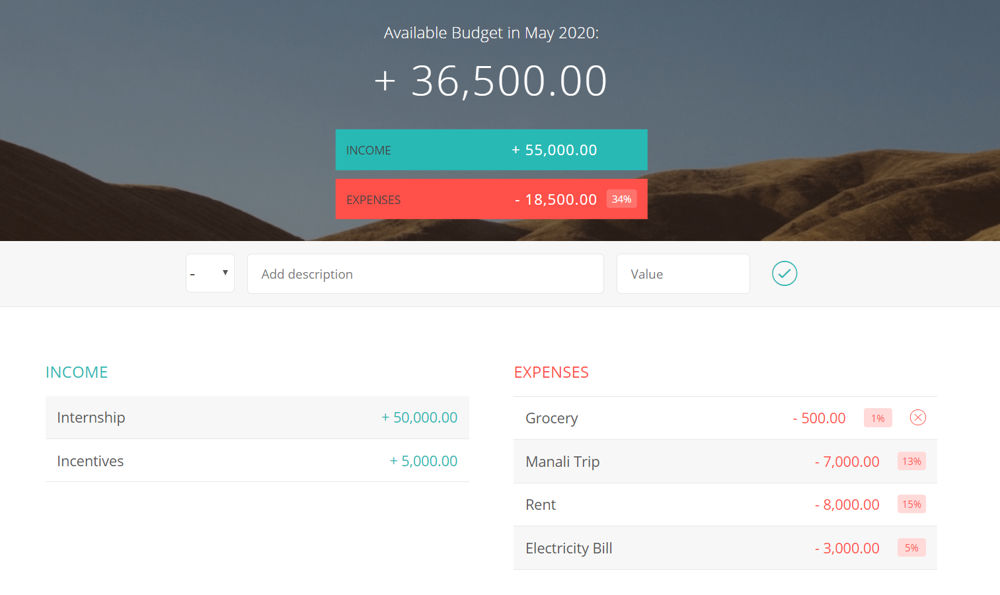

# Budget-App
An interactive web App for maintaining monthly budget.  
[Manage your money at one place](https://iprathamjain.github.io/Spending-Analyzer/)

### Features of the App

1. You can add entry for 
>  -  Expenditure
>  -  Salary
   
2. It will provide you the relative percentage of the different entries.

3. You can delete the entries too.

### Screenshot of the website

